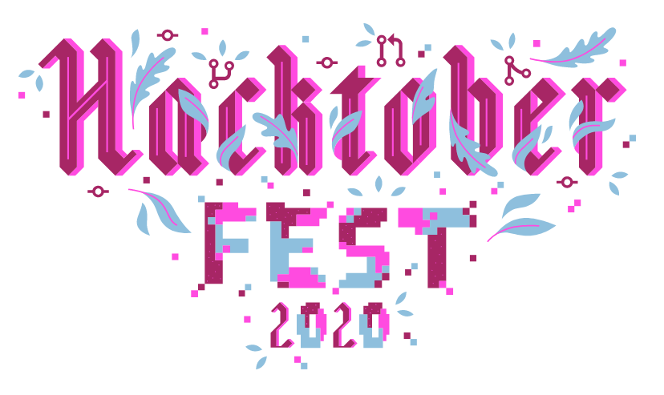
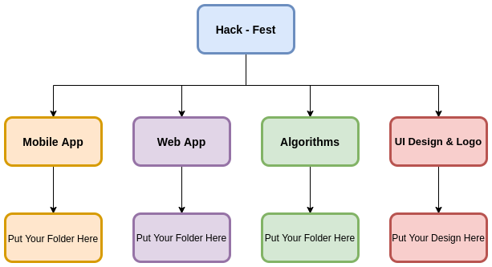

# Hack-fest

Hello World 👋

## Steps for contributing in Hactoberfest:
1. Fork this repo
2. Clone the repo
3. Create a branch
4. Checkout to the branch
5. Put your project in respective folder
- If it is related to Web Project put it in Web Folder and same for all
6. Commit the branch 
7. Make PR
8. Wait for merge...
9. After merging you completed 1 PR on hacktober fest

